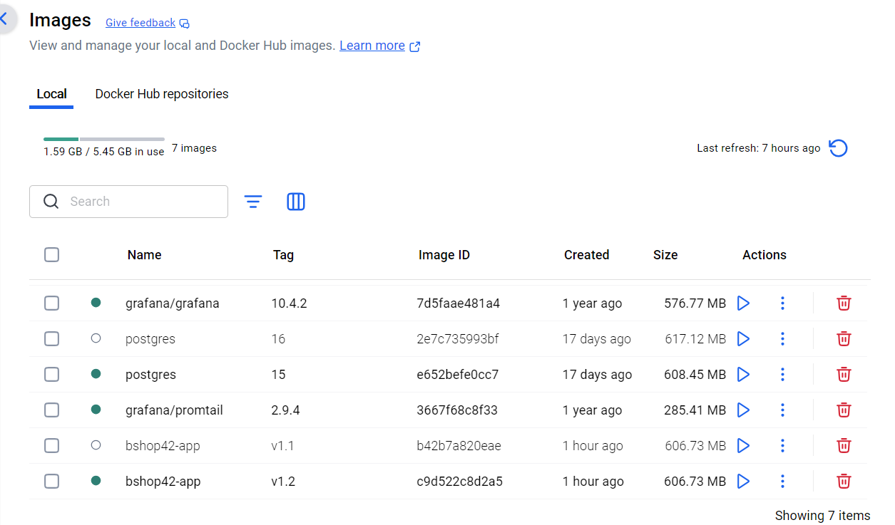
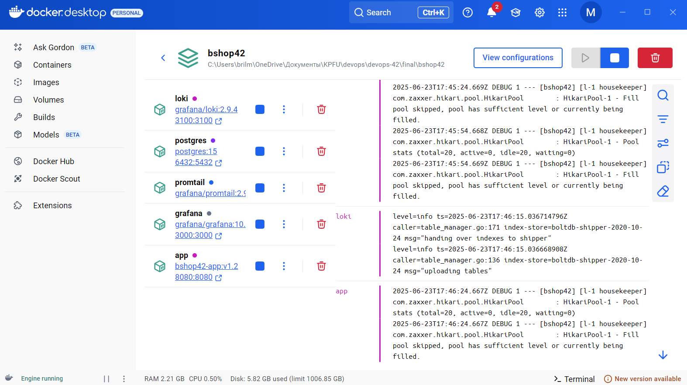
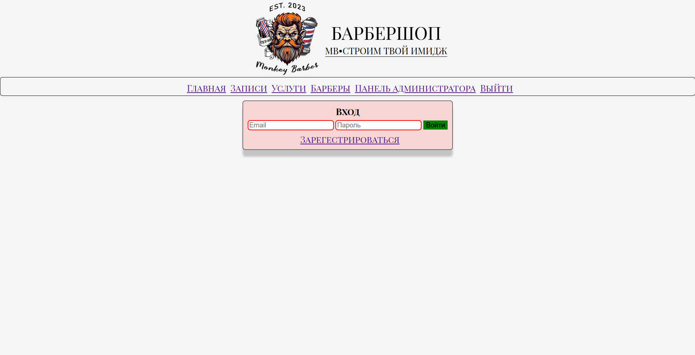
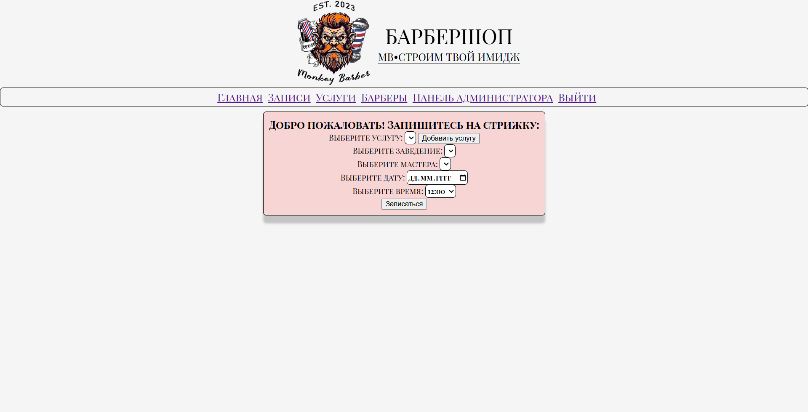
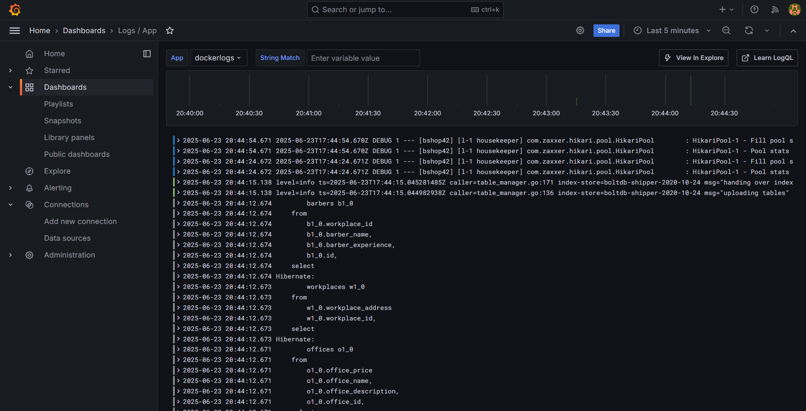

# Итоговое задание
___
### Описание проекта
Веб-приложение для записи на стрижку, 
с возможностью выбора заведения, мастера, услуги и времени. 
Регистрация и авторизация по email.
___
### Инструкция по запуску
Поднимается проект поочередным запуском скриптв `build.sh` (сборка) 
и `up.sh` с указанием аргумента `-t` версии образа. 

К примеру: `./build.sh -t v1.2` и `./build.sh -t v1.2 (или другой, уже собранный образ)`.

___
### Работоспособность приложения
1. Дизайн лютый, проект старый

2. Логи - Grafana
