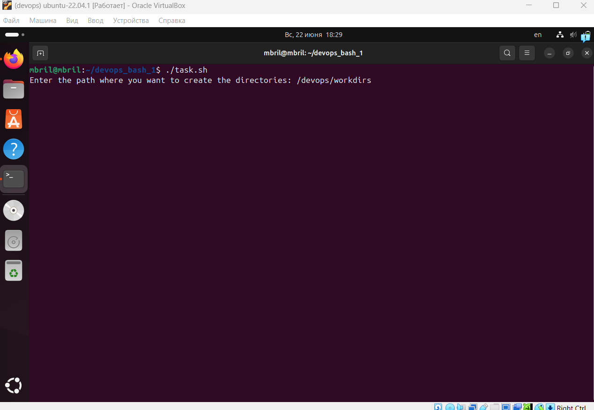
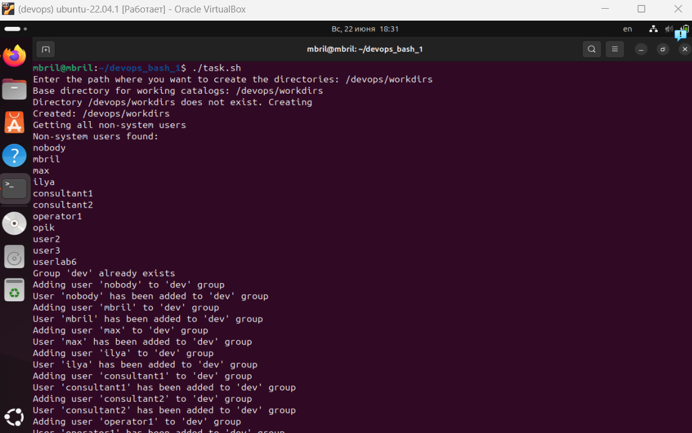
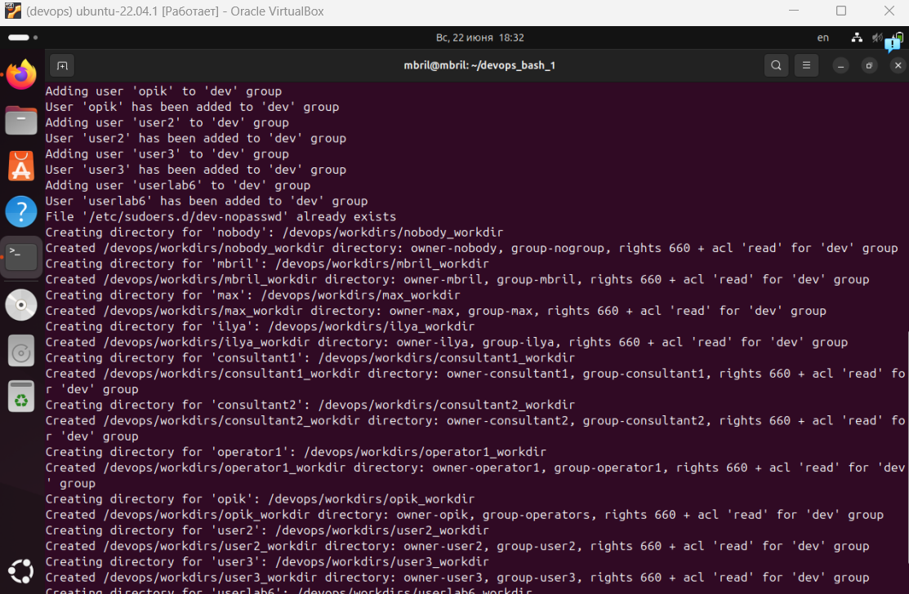
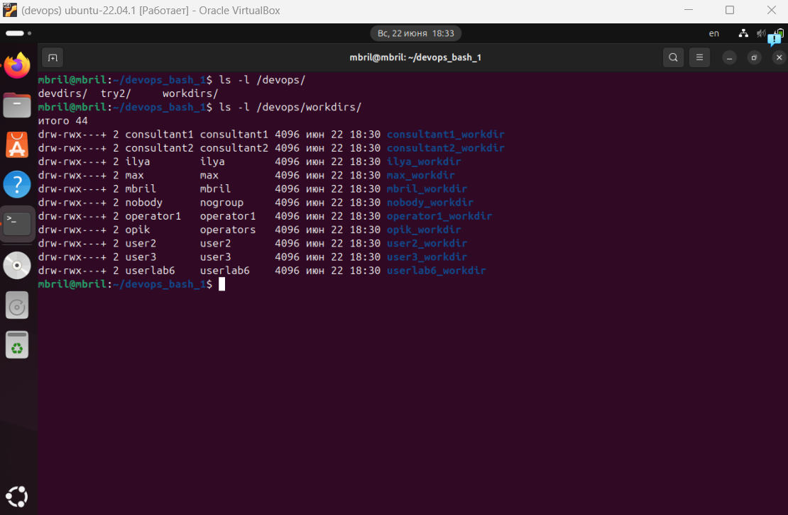
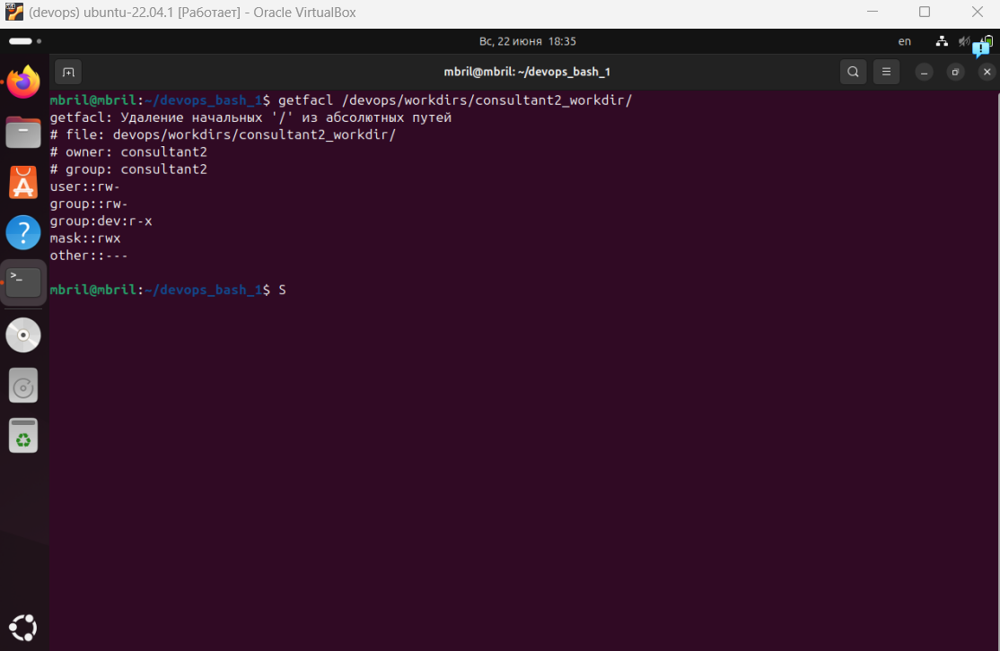
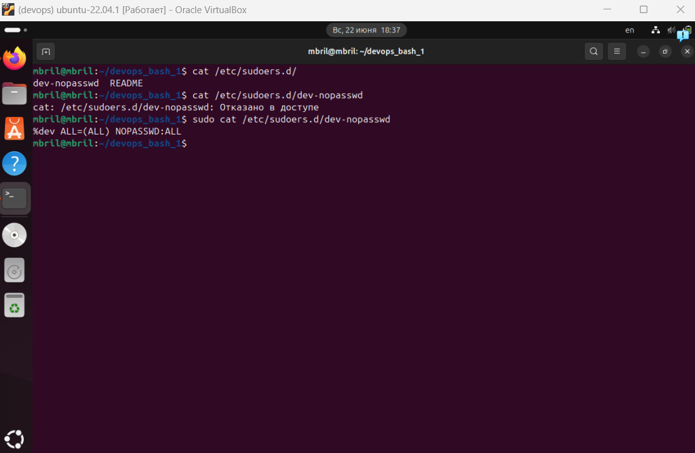

# Задание по Bash (№1)
___
### Запуск скрипта
Из директории файла
`./task.sh -d /devops/devdirs` (или после -d указать любую другую директорию,
в которой хотите создать рабочие папки)

или

просто `./task.sh`, после чего скрипт запросит указать директорию.
___
### Работа скрипта
1. Обработка аргумента __"-d"__
    - Если его нет, выводит в консоль запрос на получение директории.
2. Скрипт создает группу __'dev'__, в которую добавляет всех не системных пользователей (UID >= 1000).
3. Добавляет пользователям из __'dev'__ права на sudo без запроса пароля
   - В `/etc/sudoers.d` добавляется конфигурация **/dev-nopasswd**
   - В `/etc/sudoers.d/dev-nopasswd` прописывается `"%dev ALL=(ALL) NOPASSWD:ALL"` - разрешение всем 
из группы dev выполнять любые команды от имени любого пользователя (включая root) без пароля.
4. Для каждого пользователя из __'dev'__ создается каталог в указанной при запуске директории
по маске <user_name>_workdir
    - Каждому каталогу устанавливаются права 660, владелец - пользователь, группа - группа пользователя.
    - В помощью ACL усталавливается разрешение на чтение для группы __'dev'__.
5. Логирование по ходу выполнения скрипта происходит непосредственно в консоль и в файл ``script.log``, 
находящемся в этой же директории.
___
### Скриншоты выполнения скрипта
1. Запуск (без __"-d"__ агрумента).

2. Отработка скрипта, лог.

3. Результат:
    - Права, владельцы, группы каталогов.
   
   

    - ACL для __'dev'__
   
   

    - Файл `/etc/sudoers.d/dev-nopasswd`.
   
   