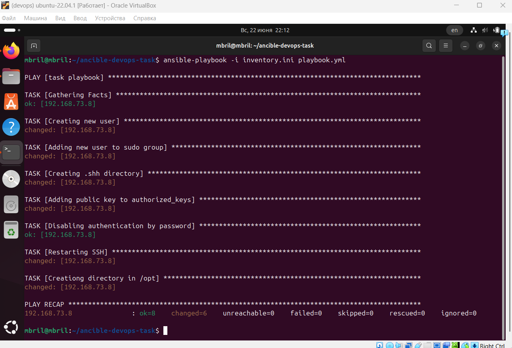
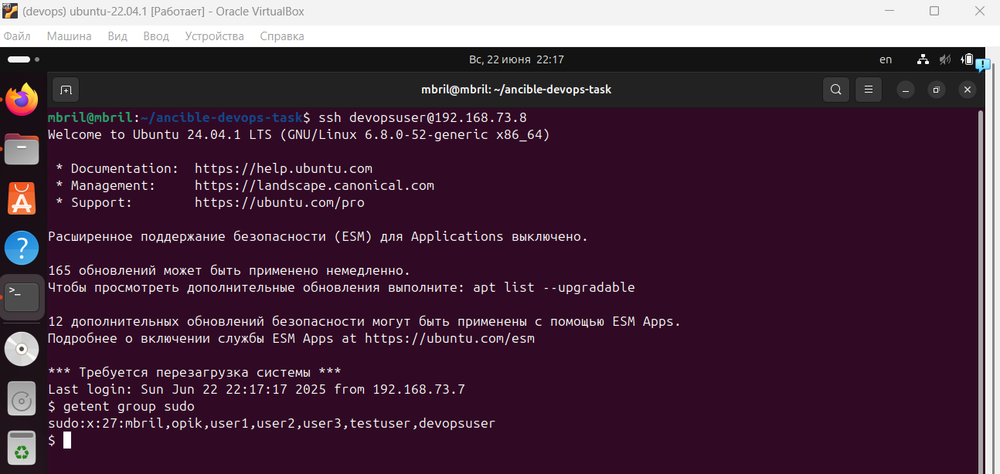
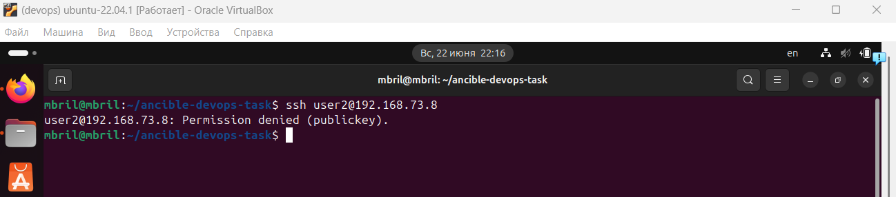
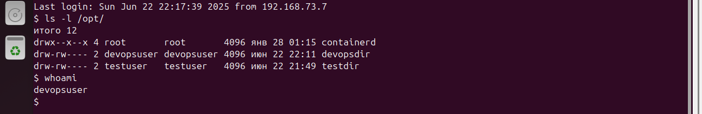

# Задание по Ansible (№2)
___
### Пояснение
Работа выполнялась для двух виртуальных машин в одной сети.
___
### Запуск
`ansible-playbook -i inventory.ini playbook.yml` в той же директории, в которой эти файлы находятся.
___
### Выполнение playbook`а
1. Создание пользователя:
   - Создается новый пользователь с именем devopsuser.
   - Вместе с ним создается его домашняя директория.
2. Новый пользователь добавляется в группу __sudo__.
3. Настройка SSH-доступа по ключу:
    - В дом. директории создается каталог __.ssh__ с правами 0700.
    - В файл authorized_keys записывается публичный ключ (из ~/.ssh/id_rsa.pub на управляющей машине).
    - Для authorized_keys устанавливаются права 0600 и владельцем назначается devopsuser.
4. Отключение авторизации по паролю в SSH:
    - В конфиг. файле SSH параметр PasswordAuthentication устанавливается в __no__.
    - Служба ssh перезапускается.
5. Создание директории в __/opt__:
    - Создается директория /opt/devopsdir.
    - Устанавливаются права 0660.
___
### Скрины результатов
1. Запуск playbook'a.

2. Проверка подключения:
    - Новым пользователем (devopsuser)
   
    
    
    - Иным пользователем (user2)

    

3. Проверка созданной в /opt директории:
